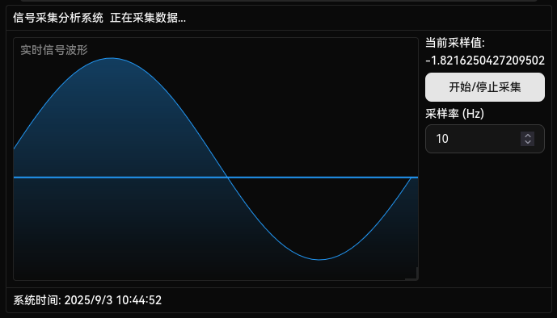

# LLM 界面生成示例应用

## 背景

现在存在很多通过 LLM 生成网页并预览的应用，但生成网页代码量很大，同时只能适应Web技术，且内部实现不可控，有很大的局限性。

当目标是通过AI根据需求动态生成应用内界面来供用户实际操作时，以上方法是行不通的，需要一种更严格、快速、可控的方法来实现界面生成。

按照通常的做法，应该让LLM生成表达界面的JSON数据，然后进行解析，这样既可以实现可控，也可以通过约束解码来保证完全准确。

然而，在实践中，使用JSON生成界面需要冗杂的类型定义，因为逻辑过于复杂，反而导致LLM容易无法理解，生成的界面也没有深度。

而更好一些的方法，是使用XML格式来生成界面，但实践上，当前的LLM普遍针对HTML进行的特化，导致XML的生成容易出错，而且XML因为语法过于复杂，无法进行有效的约束解码，虽然值得考虑，但还是略差一筹。

最终，考虑使用LISP（即 [S-expr](https://zh.wikipedia.org/wiki/S-%E8%A1%A8%E8%BE%BE%E5%BC%8F)）格式的输出，虽然对于大多数LLM来说该格式训练不足，但因为实在是非常简单，所以依旧可以获得高准确率，且可以有效地约束解码，甚至可以实现约束提示解码。

## 示例视频和图片

https://raw.githubusercontent.com/LaneSun/llm-interface-demo/refs/heads/master/assert/video.mp4

生成的示例界面:



## 安装

使用 npm 或 bun 执行 `bun i` 后再 `bun run dev` 即可。

使用前需在项目根目录放置一个 `.env` 文件，内部包含如下内容（不使用的服务可以不设置）：

```env
PUBLIC_OPENROUTER_API_KEY=<OpenRouter API 密钥>
PUBLIC_DEEPSEEK_API_KEY=<DeepSeek API 密钥>
```
