# LLM 智能界面生成系统技术文档

## 项目概述

这是一个创新的对话式应用开发框架，让大语言模型能够通过自然语言对话，动态生成可交互的用户界面。用户只需要用中文描述需求，系统就能理解并创建出相应的界面组件，实现"所想即所得"的开发体验。

## 核心特性

- 🤖 **智能对话**: 支持中文自然语言交互
- 🎨 **动态界面**: 实时生成可交互的用户界面
- 🔄 **响应式设计**: 界面能够响应数据变化和用户操作
- 🧩 **组件化架构**: 丰富的预定义界面组件库
- ⚡ **即时反馈**: 支持界面错误自动修复和重试

## 系统架构

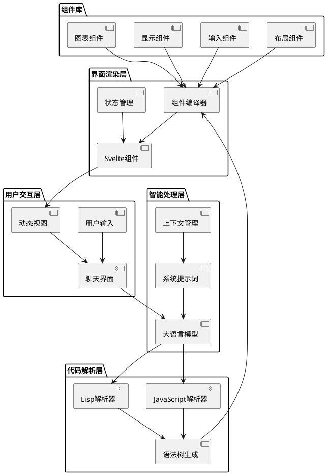

## 工作流程

### 1. 对话处理流程

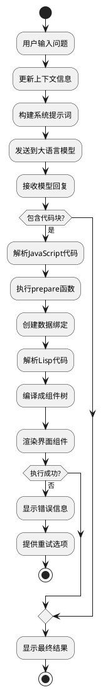

### 2. 代码解析与执行机制

系统通过特殊的代码块语法实现界面生成：

#### JavaScript 代码块
```javascript
function prepare(context) {
  const time = writable("");
  const update = () => time.set(new Date().toLocaleTimeString());
  setInterval(update, 1000);
  return {
    vtime: time,
    msg: writable("hello"),
  };
}
```

#### Lisp 代码块
```lisp
(view
  (v-box
    (input-text :value msg)
    (label "当前时间: " vtime)
    (label msg)
  )
)
```

### 3. 数据流向图

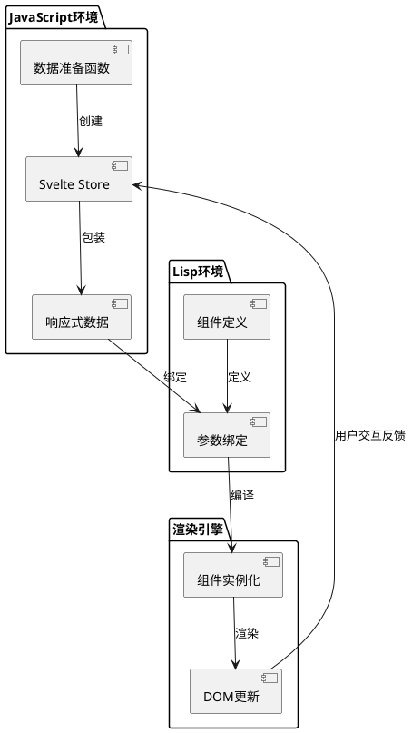

## 核心模块详解

### 1. 上下文管理系统

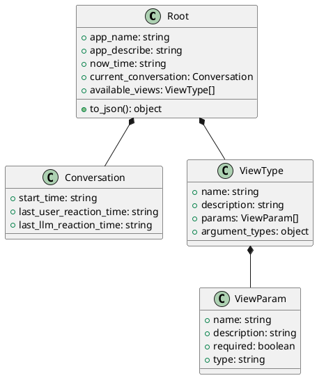

上下文管理系统负责维护应用状态和可用组件信息，为大语言模型提供完整的环境描述。

### 2. 组件系统架构

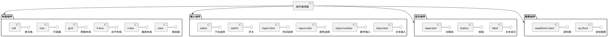

### 3. 响应式数据系统

```plantuml
@startuml 响应式数据系统
package "Svelte Store" {
  interface Store {
    +subscribe()
    +set()
    +update()
  }
  
  class Writable {
    +set(value)
    +update(fn)
  }
  
  class Readable {
    +subscribe(fn)
  }
  
  class Derived {
    +subscribe(fn)
  }
}

package "工具函数" {
  [to_readable()] - 转换为可读存储
  [to_writable()] - 转换为可写存储
  [get()] - 获取存储值
}

Writable --|> Store
Readable --|> Store  
Derived --|> Store

[JavaScript环境] --> [工具函数] : 使用
[工具函数] --> Store : 创建/操作
Store --> [Lisp环境] : 数据绑定
[Lisp环境] --> [组件属性] : 传递
@enduml
```

## 技术实现细节

### 1. 代码解析机制

系统使用正则表达式从LLM回复中提取特殊代码块：

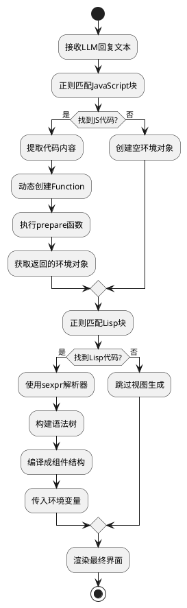

### 2. 语法树编译

Lisp表达式通过递归下降解析器转换为组件树：

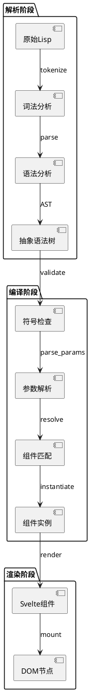

### 3. 错误处理与重试机制

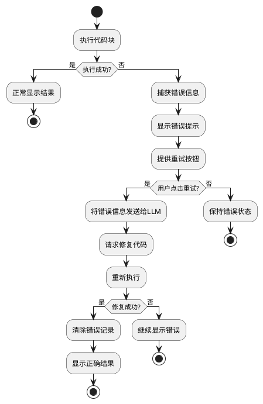

## 使用示例

### 简单计数器示例

**用户输入**：创建一个计数器，有增加和减少按钮

**LLM回复**：
```javascript
function prepare(context) {
  const count = writable(0);
  const increment = () => count.update(n => n + 1);
  const decrement = () => count.update(n => n - 1);
  
  return {
    count,
    increment,
    decrement
  };
}
```

```lisp
(view
  (v-box
    (label "计数: " count)
    (h-box
      (button :onclick increment "增加")
      (button :onclick decrement "减少")
    )
  )
)
```

### 实时时钟示例

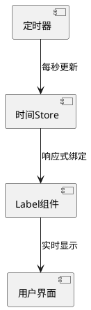

**用户输入**：显示当前时间，每秒更新

**系统生成**：
1. 创建响应式时间变量
2. 设置定时器更新机制
3. 绑定到界面组件
4. 实时显示时间变化

## 技术栈

- **前端框架**: Svelte 5 + SvelteKit
- **样式系统**: TailwindCSS
- **大语言模型**: DeepSeek/OpenRouter API
- **代码解析**: @thi.ng/sexpr
- **状态管理**: Svelte Stores
- **UI组件**: bits-ui + shadcn/ui

## 性能优化

### 1. 组件缓存机制

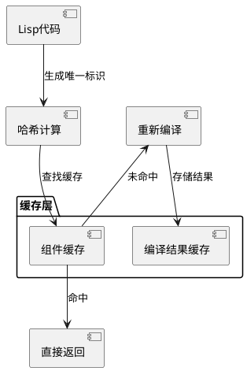

### 2. 响应式更新优化

- 使用Svelte的细粒度响应式系统
- 避免不必要的重新渲染
- 智能的依赖追踪机制

## 扩展性设计

### 1. 组件扩展

```plantuml
@startuml 组件扩展机制
interface ComponentInterface {
  +render()
  +update()
  +destroy()
}

class BaseComponent {
  +props: object
  +state: object
}

class CustomComponent {
  +customLogic()
}

BaseComponent --|> ComponentInterface
CustomComponent --|> BaseComponent

[组件注册表] --> ComponentInterface : 管理
[组件编译器] --> [组件注册表] : 查找
@enduml
```

### 2. API扩展

系统设计支持轻松添加新的：
- 界面组件类型
- 数据绑定方式  
- 交互事件处理
- 第三方服务集成

## 安全考虑

### 1. 代码执行安全

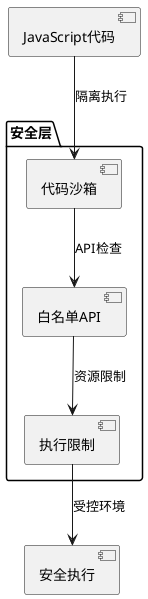

- JavaScript代码在受限环境中执行
- 仅允许访问预定义的API
- 防止恶意代码执行和资源滥用

### 2. 数据隐私

- 敏感数据不会发送到外部模型
- 支持本地模型部署
- 用户数据加密存储

## 未来发展方向

1. **多模态支持**: 图像、音频输入生成界面
2. **协作功能**: 多用户实时协作编辑
3. **模板系统**: 预定义界面模板库
4. **插件生态**: 第三方组件和功能扩展
5. **移动端支持**: 响应式移动界面适配

## 总结

这个项目创新性地结合了大语言模型的理解能力和现代前端框架的响应式特性，实现了"对话即开发"的新型交互模式。通过精心设计的双语言系统（JavaScript + Lisp），既保证了逻辑处理的灵活性，又实现了界面描述的简洁性。

系统的核心价值在于降低了界面开发的门槛，让用户可以通过自然语言快速创建复杂的交互式应用。这为未来的人机交互和应用开发模式探索了新的可能性。